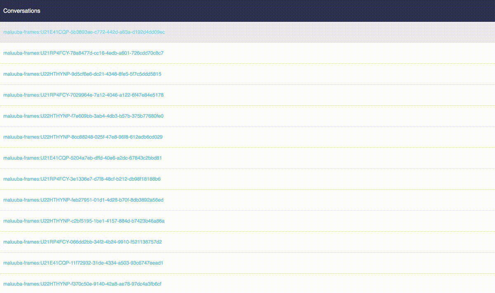

# rasa-nlu-trainer
A tool for human beings in order to classify intents and extract entities of texts loading from a raw dataset such as Rocket.chat's conversation, Maluuba Frames, etc. The output (labeled texts) is in Rasa NLU training format.



## Features
1. Loading raw texts stored in MongoDB
2. GUI for manually labeling intents and entities for the loaded texts
3. Persisting labeled texts

## Quickstart

```bash
docker-compose up -d mongo

# since the rest of services depend on mongo service
# please wait for some seconds util mongo service's status turns to be healthy
# this might be handled with https://github.com/ufoscout/docker-compose-wait/
# but here, we simply make it with this simple approach (without using  more external tools) :D :D
# check status of containers with `docker-compose ps`, then run:
docker-compose up -d
```
### Containers Accessing
**Rasa NLU Trainer:** http://localhost:8080/trainer/

**MongoDB Express:** http://localhost:8082/mongo-express/db/trainer/
